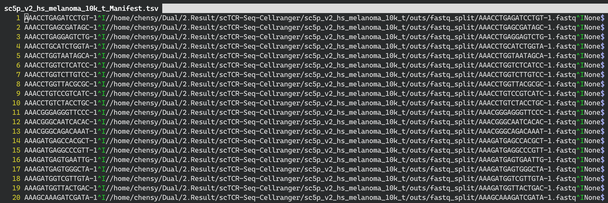

# DeRR


### What is **DERR**

DERR (Detection Dual T-cell receptor in single cell sequencing) is a toolkit for:

- Detection TCR for scRNA-Seq data
- Identification Dual-TCR  in scRNA-Seq
- Classify primary and minor chain for single CDR3 sequence

# Overview

- HomePage: [http://bioinfo.life.hust.edu.cn/DeRR]
- Github: [https://github.com/GuoBioinfoLab/DeRR]
- For detials please see our [Bioinformatics publication](!https://doi.org/10.1093/bioinformatics/btaa432)

# Installation

DeRR required follwing python packages:

* tqdm
* pandas 
* Biopython
* pysam
* networkx
* editdistance

Users could using `pip` or others package managers to install these packages like

```
pip install tqdm pandas biopython pysam networkx editdistance
```

Follwing tools are also required and shoule be able to access in PATH:

* bwa
* samtools
* fastp

We recommand using a vitrual conda envoriment to install above packages and softwares:

```Shell
# Create the envroiment and install the requirments
conda create -c conda-forge -c bioconda -n deer tqdm pandas biopython pysam networkx bwa samtools fastp editdistance -y

# As sometimes conda might be very slow, users could use mamba instead of conda for faster installation
conda install -n base -c conda-forge mamba #install mamba
mamba create -c conda-forge -c bioconda -n deer tqdm pandas biopython pysam networkx bwa samtools fastp editdistance -y #install requirments


# Activate the envoriment
conda activate deer
# Do some analysis
python DeRR.py --inf XXX --out XXX --threads number_of_threads
```


# Usage

Typical DERR command for extraction Dual TCR will look like:

```Shell
python DeRR.py --inf /path/to/manifest.tsv --out /path/to/result.tsv --threads X
```

Users should list all the FASTQ files and Cell IDs (barcode) in the **manifest** file. The manifest file should contain 3 tab-seprated columsn like

```
#For paired-end reads
Cell-id\tRead1-file-name\tRead2-file-name\n
#(Option)give output path for each cell in last row like
#Cell-id\tRead1-file-name\tRead2-file-name\Path-Output\n
#For single-end reads
Cell-id\tRead1-file-name\tNone\n
```

A  manifest file is like:



The **result.tsv** is like:

| Vgene    | Jgene    | CDR3            | Counts | Chain | CellId             |
| -------- | -------- | --------------- | ------ | ----- | ------------------ |
| TRAV3    | TRAJ27   | CAHNTNAGKSTF    | 13     | TRA   | AAACCTGAGATCCTGT-1 |
| TRBV3-1  | TRBJ2-7  | CASSQGGALTYEQYF | 198    | TRB   | AAACCTGAGCGATAGC-1 |
| TRBV11-2 | TRBJ22-4 | CASSFDGLAKNIQYF | 68     | TRB   | AAACCTGAGGAGTCTG-1 |
| TRAV9-2  | TRAJ49   | CALFAGNQFYF     | 139    | TRA   | AAACCTGCATCTGGTA-1 |


For **10X V(D)J** sequencing data which don't provide FASTQ files for each cell, we provide a script help demulpitexing the data:

```
python SplitVDJbam.py --bam all_contig.bam --list cell_barcodes.json --out /path/to/fastq_output --file /path/to/Manifest.tsv
```
where `all_contig.bam` and `cell_barcodes.json` is the output from cellranger, usually located in `ProjectName/outs`


